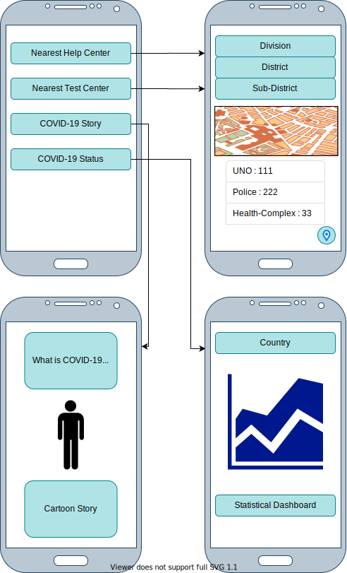

## Functionalities

* **Nearest COVID-19 Help Center**
  
  * User request way
    1. User can select Division > District > Sub-District 
    2. User GPS map location
  * Response
    1. A list of help center with name, contact info and address
    2. MAP view
  
  
  
* **Nearest COVID-19 Test Center**

  * User request way
    1. User can select Division > District > Sub-District 
    2. GPS Map location
  * Response
    1. A list of testing center with name, contact info and address
    2. MAP view

* **COVID-19 Story** (additional feature if possible)

  A cartoon/picturized series of story that will represent.

  * What is COVID-19
  * What are the symptoms of COVID-19
  * What should I do to protect myself from COVID-19 

* **COVID-19 Status** (additional feature if possible)

  Use an API to fetch data and make statistical report and graph

Features will be presented in English. But presentation will be presented in Bengali language also. Like **COVID-19 Story**, help center items.

**A sample prototype  is given below**

